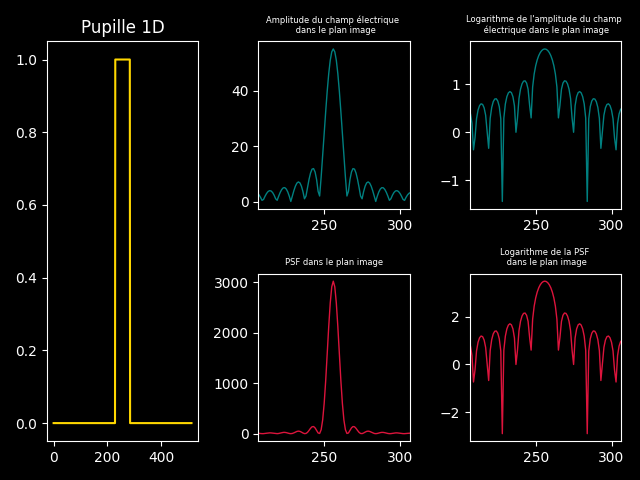
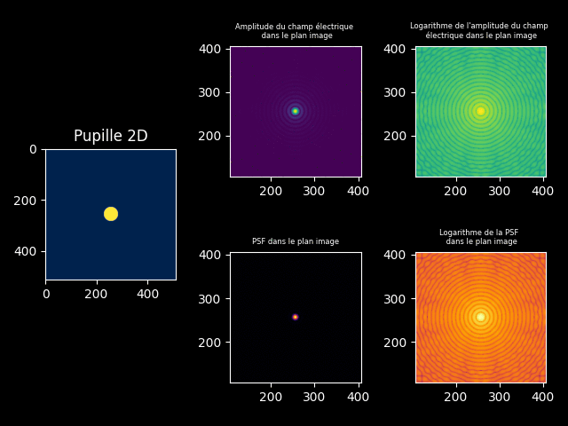

## Calcul de l'amplitude du champ électrique et de la PSF (point spread function) dans le plan image en fonction de la pupille utilisée, en 1D et 2D

Un programme codé en Python pour calculer l'amplitude du champ électrique et la PSF dans le plan image en fonction de la pupille utilisée, en 1D et 2D

### Aperçu

Amplitude du champ électrique et PSF 1D :

  

Amplitude du champ électrique et PSF 2D :

  

